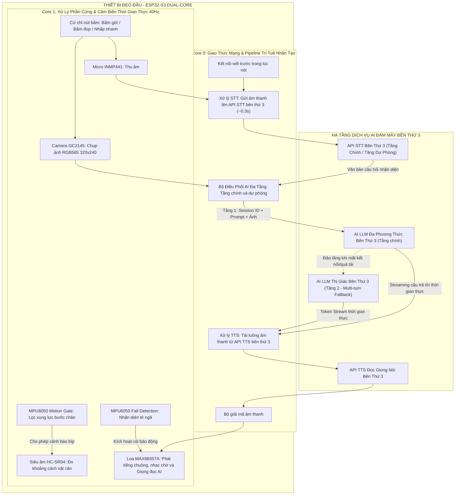
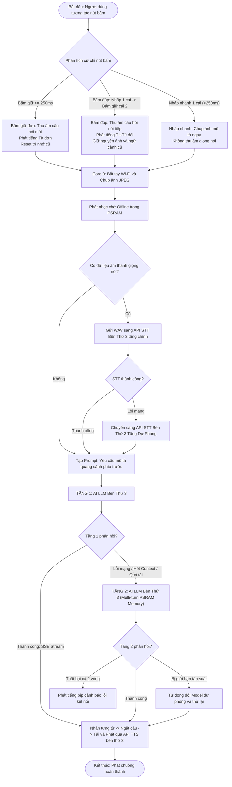
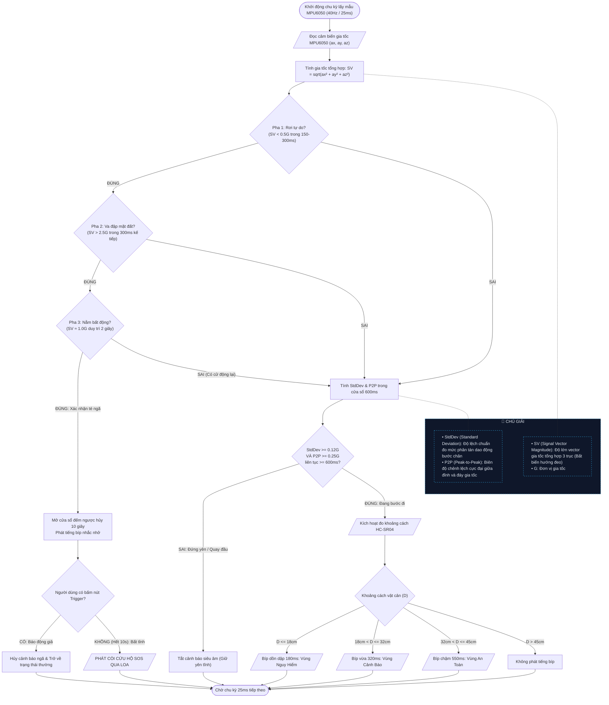

# BÁO CÁO LƯU ĐỒ GIẢI THUẬT HỆ THỐNG AEGIS SIGHT
**Dự Án: Kính Thông Minh Trợ Thị Đa Trí Tuệ Nhân Tạo Dành Cho Người Khiếm Thị**

---

## 🏛️ 1. LƯU ĐỒ KIẾN TRÚC TOÀN HỆ THỐNG (SYSTEM ARCHITECTURE FLOWCHART)

Sơ đồ thể hiện sự phân bổ xử lý giữa phần cứng nhúng **Dual-Core FreeRTOS (ESP32-S3)** và **Hạ Tầng Dịch Vụ AI Đám Mây Bên Thứ 3**:

---

## 🧠 2. LƯU ĐỒ GIẢI THUẬT AI PIPELINE ĐA TẦNG (MULTIMODAL AI PIPELINE)

Sơ đồ thể hiện chu trình nhận diện cử chỉ, chuyển đổi giọng nói thành văn bản qua API STT bên thứ 3, cây quyết định chuyển tầng AI (Failover Logic) và phát âm thanh thời gian thực (TTS Streaming):

---

## 🚶 3. LƯU ĐỒ CẢM BIẾN

