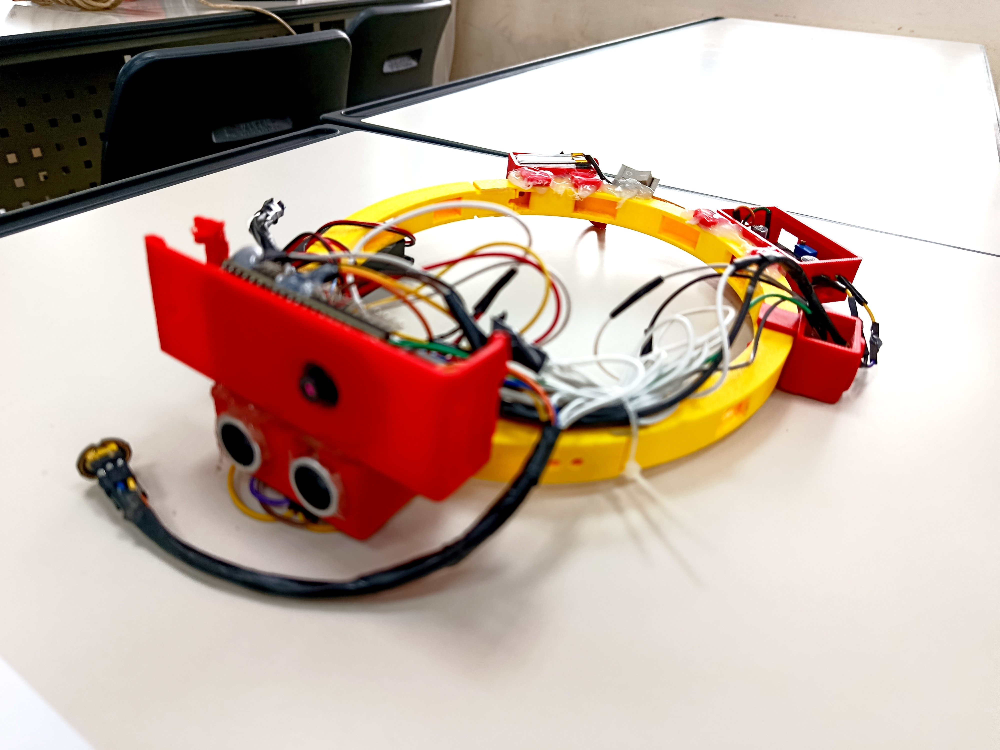
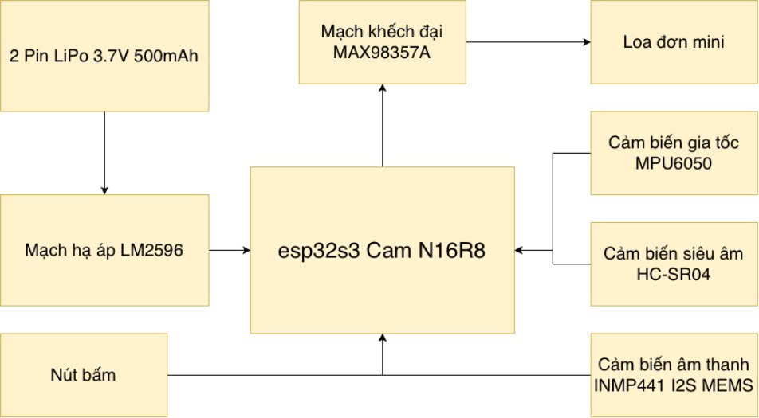
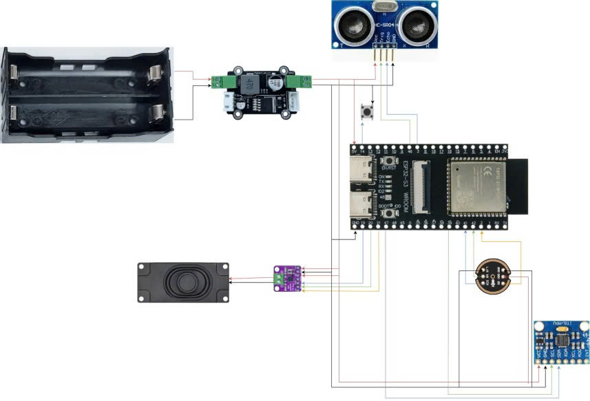
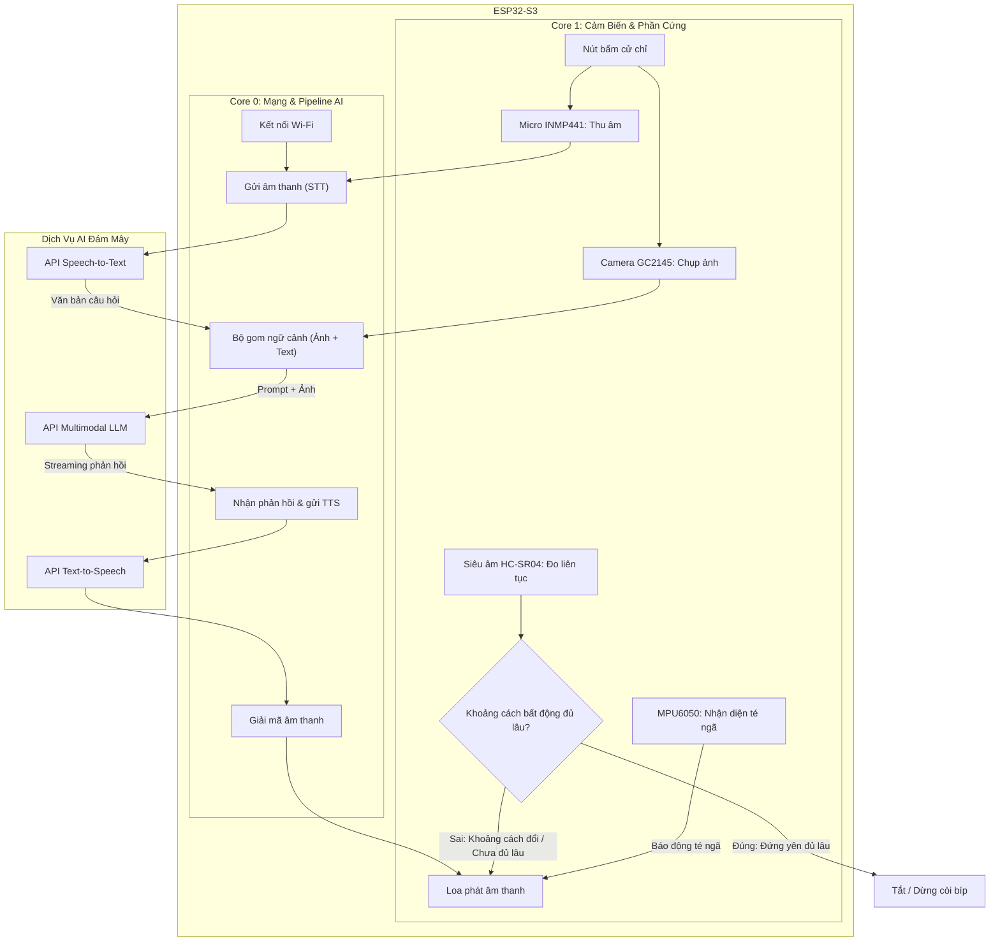

# Aegis Sight

**Kính Thông Minh Trợ Thị Tích Hợp Đa Trí Tuệ Nhân Tạo Dành Cho Người Khiếm Thị**

Aegis Sight là thiết bị đeo hỗ trợ người khiếm thị xây dựng trên nền tảng vi điều khiển **ESP32-S3 (16MB Flash, 8MB PSRAM)** tích hợp Camera, Micro I2S, Loa Khuếch đại MAX98357A, Cảm biến Siêu âm HC-SR04 và IMU MPU6050 — tương tác giọng nói thời gian thực với độ trễ cực thấp (<1.5s) thông qua kiến trúc **Đa Tầng AI Hoán Đổi Thông Minh (Google Gemini + Groq LPU)**.



---

## 🌟 Tính Năng Nổi Bật

- **🤖 AI Đa Tầng Thời Gian Thực (<1.5s)**:
  - **Tầng 1 (Chính)**: **Google Gemini Interactions API (`gemini-3.5-flash-lite`)** với SSE Streaming trực tiếp và lưu trữ Session ID ngữ cảnh Server-side.
  - **Tầng 2 (Dự phòng)**: **Groq Vision LLM (`qwen/qwen3.8-27b` / `qwen/qwen3.6-27b`)** với bộ nhớ Multi-turn lưu trữ trong 8MB PSRAM.
  - **STT Giọng Nói**: **Groq Whisper Large v3** (~0.3s) + Dự phòng **Deepgram Nova-3**.
  - **TTS Phát Loa**: Google Translate TTS với DNS Caching 0ms + Streaming MP3 Chunk 4KB.
  - **Nhạc Chờ**: Elevator Music giải mã sẵn trong PSRAM (Zero-CPU) phát trong lúc chờ AI phản hồi.
- **🎮 Cử Chỉ Nút Bấm Đa Năng**:
  - **Bấm Giữ ($\ge 250\text{ms}$)**: Hỏi câu hỏi mới (Tiếng "Tít" đơn, reset ngữ cảnh).
  - **Bấm Đúp (Nhấp 1 cái $\rightarrow$ Bấm giữ cái thứ 2)**: Nối tiếp hội thoại cũ (Tiếng "Tít-Tít" đôi, soi lại ảnh cũ và nhớ câu trả lời trước).
  - **Nhấp Nhanh 1 Cái (<250ms)**: Chụp ảnh mô tả nhanh quang cảnh/chữ viết phía trước (không cần nói).

https://github.com/user-attachments/assets/9ad10305-b671-4515-bde3-f32feec600b8

<p align="center"><sub><em>Demo feature: Cử chỉ nút bấm & phản hồi AI đa tầng (🔊 Bật âm thanh để nghe phản hồi loa)</em></sub></p>

- **🚶 Motion Gate (Cảm Biến Siêu Âm Thông Minh)**:
  - Cảm biến khoảng cách HC-SR04 **chỉ phát tiếng bíp khi người dùng thực sự bước đi** (nhận diện xung lực gót chân đập xuống đất: $\text{StdDev} \ge 0.12\text{G}$ và $\text{P2P} \ge 0.25\text{G}$).
  - Đứng yên, ngồi yên hoặc **xoay đầu nhìn quanh tại chỗ $\rightarrow$ Mute $100\%$**, trả lại không gian yên tĩnh.

https://github.com/user-attachments/assets/c8f814bc-7011-4c58-a6e2-c438269c0b52

<p align="center"><sub><em>Demo feature: Motion Gate cảm biến siêu âm (🔊 Bật âm thanh để nghe tiếng bíp cảnh báo vật cản)</em></sub></p>

- **🚨 Phát Hiện Té Ngã (Fall Detection 3 Pha)**:
  - MPU6050 nhận diện: Rơi tự do ($<0.5\text{g}$) $\rightarrow$ Va đập ($>2.5\text{g}$) $\rightarrow$ Bất động ($\approx 1\text{g}$).
  - Cửa sổ hủy 10s (bấm nút để hủy) $\rightarrow$ Phát còi báo động SOS cứu hộ ra loa.

https://github.com/user-attachments/assets/5a917cbf-5cbe-458b-b86c-3e41018f8a89

<p align="center"><sub><em>Demo feature: Thuật toán phát hiện té ngã 3 pha & còi SOS (🔊 Bật âm thanh để nghe còi cứu hộ)</em></sub></p>


- **⚙️ Config Portal (Cấu Hình Lần Đầu)**:
  - Tự phát Wi-Fi AP `AegisSight-Setup` $\rightarrow$ Mở Captive Portal nhập SSID/Pass + API Key lưu NVS.
  - Sau này muốn setup lại có thể bấm 5 lần vào nút nguồn (GPIO 14) hoặc reset dữ liệu PSRAM

---

## 🔌 Sơ Đồ Chân Phần Cứng (Hardware Pinout)

| Module / Ngoại vi | Chân Phần Cứng | Chân ESP32-S3 GPIO | Ghi chú |
|---|---|---|---|
| **Camera GC2145 (DVP)** | SIOD / SIOC / PCLK / XCLK / VSYNC / HREF / Y2..Y9 | `4, 5, 13, 15, 6, 7, 11, 9, 8, 10, 12, 18, 17, 16` | FPC cố định trên bo mạch |
| **Loa MAX98357A (I2S TX)** | DIN / BCLK / LRC | `DIN=19, BCLK=20, LRC=21` | I2S Channel 1, cấp nguồn 5V từ Buck |
| **Micro INMP441 (I2S RX)** | SD / SCK / WS / L/R | `SD=2, SCK=41, WS=42, L/R=GND` | I2S Channel 0, Left Channel 16kHz |
| **Siêu Âm HC-SR04** | Trig / Echo | `Trig=46, Echo=3` | Nguồn 5V từ Buck, chân tự do an toàn |
| **MPU6050 (I2C)** | SDA / SCL | `SDA=47, SCL=39` | Bus I2C phần cứng |
| **Nút Nhấn Trigger** | Data / GND | `GPIO14 (INPUT_PULLUP)` | Active LOW |




---

## 🏗️ System Flowcharts (Kiến Trúc & Lưu Đồ Giải Thuật)



---

## ⚡ Hướng Dẫn Biên Dịch & Nạp Firmware

```bash
# Biên dịch và nạp firmware qua cổng USB
pio run -t upload

# Mở Serial Monitor với tốc độ 2.000.000 baud (2Mbps)
pio device monitor -b 2000000
```

---

## 📁 Cấu Trúc Thư Mục

```
include/
├── config.h              Định nghĩa chân GPIO, ngưỡng cảm biến & cờ tính năng
├── secrets.h             Định nghĩa các NVS Key cho Wi-Fi và API Key
├── tone_driver.h         Driver phát loa I2S, nhạc chờ và Ring Buffer AI
├── tts_driver.h          Driver tải & giải mã MP3 Google TTS
├── motion_gate.h         Bộ lọc nhận diện bước chân MPU6050
└── ai_pipeline.h         Khai báo pipeline đa tầng AI & FreeRTOS tasks

src/
├── main.cpp              Khởi động hệ thống, kiểm tra NVS & spawn FreeRTOS tasks
├── ai_pipeline.cpp       Toàn bộ pipeline AI: Thu âm, Gemini SSE, Groq Vision, Whisper STT
├── motion_gate.cpp       Thuật toán lọc xung lực bước chân (StdDev + Peak-to-Peak)
├── tone_driver.cpp       Phát nhạc chờ PSRAM, tiếng chuông & I2S Stream Loa
├── tts_driver.cpp        HTTP Google TTS với DNS Cache & Helix Decoder
├── ultrasonic_proximity.cpp Cảm biến HC-SR04 tích hợp Motion Gate (40Hz)
├── fall_detection.cpp    State machine 3 pha phát hiện ngã
├── mpu_manager.cpp       Quản lý bus I2C & lấy mẫu MPU6050
├── secrets.cpp           NVS Preferences lưu trữ credentials
└── config_portal.cpp     Web captive portal cấu hình Wi-Fi lần đầu
```
