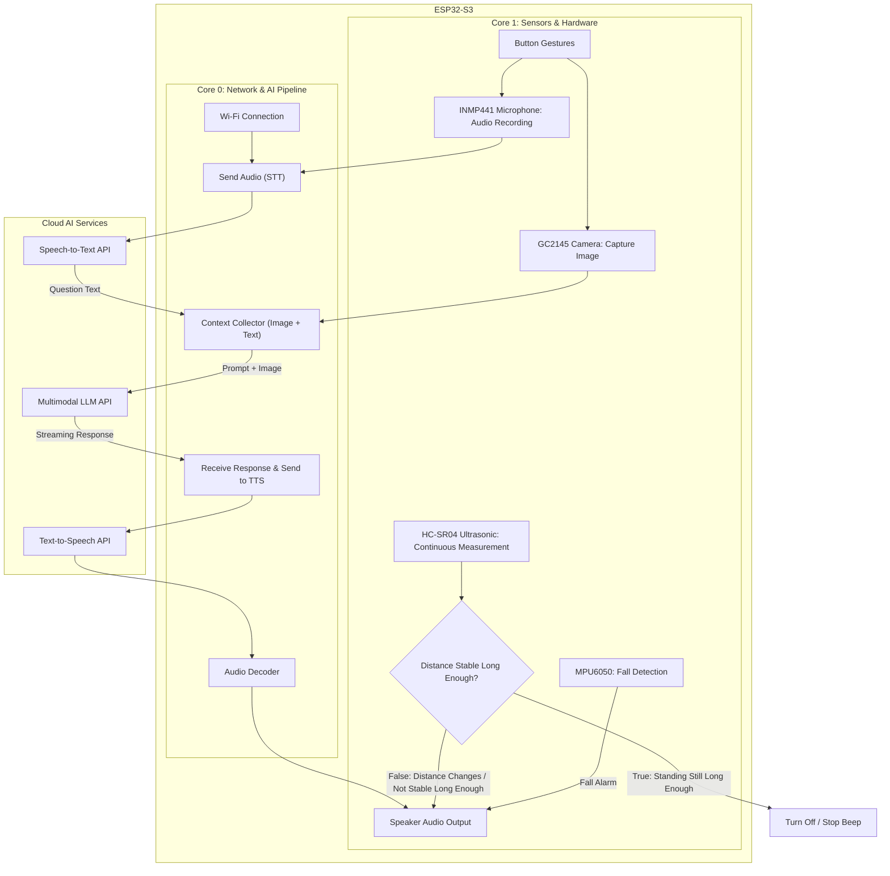

# Aegis Sight

**Smart Assistive Glasses with Multi-AI Integration for People with Visual Impairments**

Aegis Sight is a wearable assistive device for people with visual impairments, built on the **ESP32-S3 (16MB Flash, 8MB PSRAM)** platform. It integrates a Camera, I2S Microphone, MAX98357A Amplifier Speaker, HC-SR04 Ultrasonic Sensor, and MPU6050 IMU. It supports real-time voice interaction with stable latency (<6s) through a **Smart Multi-Level AI Switching Architecture (Google Gemini + Groq LPU)**.


---

## 🌟 Key Features

* **🤖 Real-Time Multi-Level AI (<1.5s)**:

  * **Level 1 (Primary)**: **Google Gemini Interactions API (`gemini-3.5-flash-lite`)** with direct SSE Streaming and server-side Session ID context storage.
  * **Level 2 (Backup)**: **Groq Vision LLM (`qwen/qwen3.8-27b` / `qwen/qwen3.6-27b`)** with Multi-turn memory stored in 8MB PSRAM.
  * **Voice STT**: **Groq Whisper Large v3** (~0.3s) + **Deepgram Nova-3** as backup.
  * **Speaker TTS**: Google Translate TTS with 0ms DNS Caching + 4KB MP3 Chunk Streaming.
  * **Waiting Music**: Pre-decoded Elevator Music stored in PSRAM (Zero-CPU), played while waiting for the AI response.

* **🎮 Multi-Function Button Gestures**:

  * **Long Press (≥250ms)**: Ask a new question (single "Beep" sound, reset context).
  * **Double Action (Tap once → Long press the second time)**: Continue the previous conversation (double "Beep-Beep" sound, re-scan the previous image and remember the previous answer).
  * **Quick Single Tap (<250ms)**: Take a photo to quickly describe the scene/text in front (no voice input needed).

https://github.com/user-attachments/assets/9ad10305-b671-4515-bde3-f32feec600b8

<p align="center"><sub><em>Demo feature: Button gestures & multi-level AI response (🔊 Turn on sound to hear the speaker response)</em></sub></p>

* **🚶 Motion Gate (Smart Ultrasonic Sensor)**:

  * The HC-SR04 distance sensor **only beeps when the user is actually walking toward a danger**.
  * When standing still, the device stops giving warnings.

https://github.com/user-attachments/assets/c8f814bc-7011-4c58-a6e2-c438269c0b52

<p align="center"><sub><em>Demo feature: Ultrasonic sensor Motion Gate (🔊 Turn on sound to hear the obstacle warning beep)</em></sub></p>

* **🚨 Fall Detection (3-Phase)**:

  * MPU6050 detects: Free Fall (<0.5g) → Impact (>2.5g) → No Movement for 3s (≈1g).
  * Plays an SOS rescue alarm through the speaker.
  * False alarms can be canceled using the power button (GPIO 14).

https://github.com/user-attachments/assets/5a917cbf-5cbe-458b-b86c-3e41018f8a89

<p align="center"><sub><em>Demo feature: 3-phase fall detection algorithm & SOS alarm (🔊 Turn on sound to hear the rescue alarm)</em></sub></p>

* **⚙️ Config Portal (First-Time Setup)**:

  * Automatically creates a Wi-Fi AP `AegisSight-Setup` → Opens a Captive Portal to enter SSID/Password + API Keys, stored in NVS.
  * To set up again later, press the power button (GPIO 14) 5 times or reset PSRAM data.

---

## 🔌 Hardware Pinout

| Module / Peripheral             | Hardware Pins                                     | ESP32-S3 GPIO Pins                                 | Notes                                |
| ------------------------------- | ------------------------------------------------- | -------------------------------------------------- | ------------------------------------ |
| **Camera GC2145 (DVP)**         | SIOD / SIOC / PCLK / XCLK / VSYNC / HREF / Y2..Y9 | `4, 5, 13, 15, 6, 7, 11, 9, 8, 10, 12, 18, 17, 16` | Fixed FPC on the board               |
| **Speaker MAX98357A (I2S TX)**  | DIN / BCLK / LRC                                  | `DIN=19, BCLK=20, LRC=21`                          | I2S Channel 1, 5V power from Buck    |
| **Microphone INMP441 (I2S RX)** | SD / SCK / WS / L/R                               | `SD=2, SCK=41, WS=42, L/R=GND`                     | I2S Channel 0, Left Channel 16kHz    |
| **Ultrasonic HC-SR04**          | Trig / Echo                                       | `Trig=46, Echo=3`                                  | 5V power from Buck, safe unused pins |
| **Trigger Button**              | Data / GND                                        | `GPIO14 (INPUT_PULLUP)`                            | Active LOW                           |


---

## 🏗️ System Flowcharts (Architecture & Algorithm Flow)



---

## ⚡ Firmware Build & Upload Guide

```bash
# Build and upload firmware through USB
pio run -t upload

# Open Serial Monitor at 2,000,000 baud (2Mbps)
pio device monitor -b 2000000
```

---

## 📁 Folder Structure

```text
include/
├── config.h              GPIO pin definitions, sensor thresholds & feature flags
├── secrets.h             NVS Key definitions for Wi-Fi and API Keys
├── tone_driver.h         I2S speaker driver, waiting music and AI Ring Buffer
├── tts_driver.h          Google TTS MP3 download and decoding driver
├── motion_gate.h         Step detection filter using MPU6050
└── ai_pipeline.h         AI pipeline declarations & FreeRTOS tasks

src/
├── main.cpp              System startup, NVS check & FreeRTOS task spawning
├── ai_pipeline.cpp       Full AI pipeline: Audio Recording, Gemini SSE, Groq Vision, Whisper STT
├── motion_gate.cpp       Step impulse filtering algorithm (StdDev + Peak-to-Peak)
├── tone_driver.cpp       PSRAM waiting music, notification sounds & I2S Speaker Stream
├── tts_driver.cpp        Google TTS HTTP with DNS Cache & Helix Decoder
├── ultrasonic_proximity.cpp HC-SR04 integrated with Motion Gate (40Hz)
├── fall_detection.cpp    3-phase fall detection state machine
├── mpu_manager.cpp       I2C bus management & MPU6050 sampling
├── secrets.cpp           NVS Preferences for credential storage
└── config_portal.cpp     Captive portal for first-time Wi-Fi setup
```

---

## 🏆️ Honors and Recognition

* **PIFKID IoT (HCMUT x Intel)** - *Champion (1st prize)* (2026)
* Detail: Scored and evaluated by HCMUT lecturers and a panel from Intel.

<p align="center">
  
  <br />
  <em>Project presentation and award ceremony at the PIFKID final report</em>
</p>

<p align="center">
  
  <br />
  <em>Champion award with the product</em>
</p>
